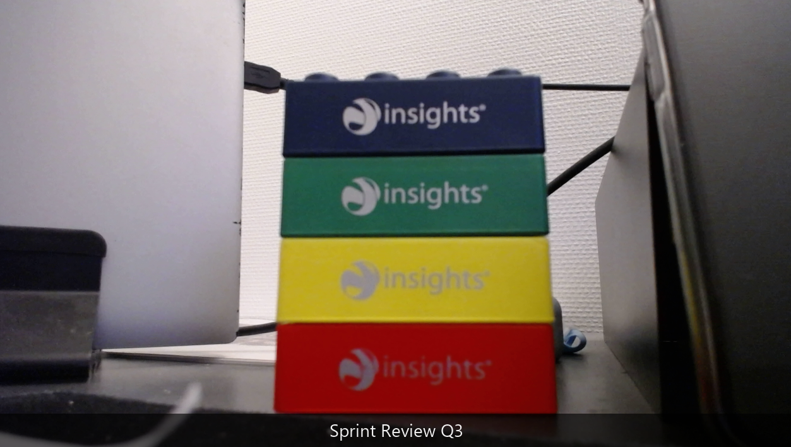

# Webcam Overlay for Teams

Tilføjer et dynamisk tekst-overlay til dit webcam og eksponerer det som en virtuel kamera-enhed, som Teams (og andre apps) kan bruge.

## Arkitektur

```
Dit webcam → OpenCV → overlay (Pillow) → pyvirtualcam → Unity Capture driver
                                                              ↓
                                                    Teams vælger "Unity Video Capture"

POST localhost:5123/overlay  ← opdaterer teksten live
```

## Installation (Windows)

### 1. Unity Capture-driver

Driveren skaber den virtuelle kamera-enhed i Windows.

1. Download seneste release fra: https://github.com/schellingb/UnityCapture/releases
2. Pak zip-filen ud
3. Åbn **PowerShell som Administrator**
4. Kør:
   ```powershell
   cd <sti-til-udpakket-mappe>\Install
   regsvr32 /s UnityCaptureFilter64bit.dll
   ```
5. Verificér: åbn Teams → Indstillinger → Enheder → Kamera → du bør se **"Unity Video Capture"**

### 2. Python-afhængigheder

```powershell
python -m venv .venv
source .venv/Scripts/activate
pip install -r requirements.txt
```

## Brug

### Start

```powershell
python overlay.py
```

Tilføj `--preview` for at se et lokalt preview-vindue på din egen skærm (tryk **Q** i vinduet for at lukke):

```powershell
python overlay.py --preview
```

Outputtet viser:

```
[API]  http://localhost:5123
[CAM]  Webcam opened: 1280×720
[VCAM] Device: Unity Video Capture
[RUN]  Kører – tryk Ctrl+C for at stoppe
```

Vælg nu **"Unity Video Capture"** som kamera i Teams.

### Opdater overlay-tekst

Brug **PowerShell** (anbefalet – håndterer specialtegn som tankestreger korrekt):

```powershell
# Sæt tekst i bunden (default)
Invoke-RestMethod -Method Post -Uri http://localhost:5123/overlay `
  -ContentType "application/json; charset=utf-8" `
  -Body ([System.Text.Encoding]::UTF8.GetBytes('{"text": "Sprint Review – Q3", "position": "bottom"}'))

# Sæt tekst i toppen
Invoke-RestMethod -Method Post -Uri http://localhost:5123/overlay `
  -ContentType "application/json; charset=utf-8" `
  -Body ([System.Text.Encoding]::UTF8.GetBytes('{"text": "Alexander – Team Volt", "position": "top"}'))

# Fjern overlay (tom tekst)
Invoke-RestMethod -Method Post -Uri http://localhost:5123/overlay `
  -ContentType "application/json" `
  -Body '{"text": ""}'

# Se nuværende state
Invoke-RestMethod http://localhost:5123/overlay
```

Fra Git Bash / curl – brug **kun ASCII-tekst** (tankestreger og andre specialtegn kan give encoding-fejl):

```bash
# Virker fint med ASCII
curl -X POST http://localhost:5123/overlay \
  -H "Content-Type: application/json" \
  -d '{"text": "Sprint Review Q3", "position": "bottom"}'

# Se nuværende state
curl http://localhost:5123/overlay
```

### Valgfrie argumenter

| Argument    | Default | Beskrivelse                                        |
|-------------|---------|----------------------------------------------------|
| `--port`    | 5123    | API-port                                           |
| `--cam`     | 0       | Webcam-enhedsindex                                 |
| `--width`   | 1280    | Ønsket opløsningsbredde                            |
| `--height`  | 720     | Ønsket opløsningshøjde                             |
| `--fps`     | 30      | Target framerate                                   |
| `--preview` | slået fra | Åbn lokalt preview-vindue (tryk Q for at lukke) |

## Fejlfinding

**"Webcam index 0 could not be opened"**
→ Prøv `--cam 1` (eller højere). Andre apps kan låse kameraet.

**"Virtual camera failed"**
→ Unity Capture er ikke installeret, eller DLL'en blev ikke registreret. Kør `regsvr32` igen som admin.

**Teams viser ikke "Unity Video Capture"**
→ Genstart Teams efter installation af driveren.

**Overlay er langsomt / hakker**
→ Sænk opløsning (`--width 640 --height 480`) eller FPS (`--fps 15`).


## Eksempel på brug - Preview
